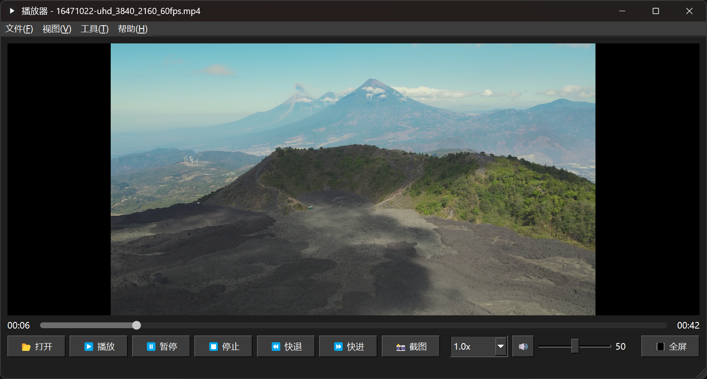
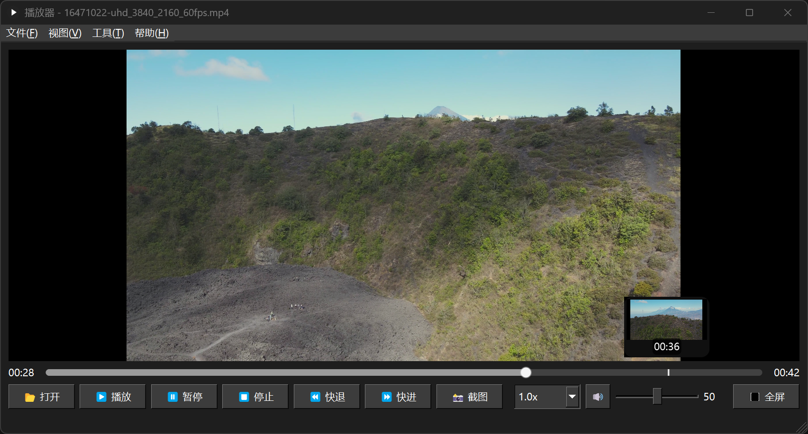

# QT-Player

## 基础功能

1. 支持的媒体类型

- 支持播放**音视频文件**
- 可单独播放**纯音频**（如 MP3、AAC）或**纯视频**（无声视频）

2. 播放控制功能

- **播放 / 暂停 / 停止**：基础播放操作控制
- **快进 / 快退**：支持5秒为单位快速跳转
- **进度条拖动**：任意时间点跳转播放
- **倍速播放**：支持0.5x ~ 3.0x 倍速切换（默认 1.0x）

3. 实用增强功能

- **截图当前帧**：一键保存当前画面为图片
- **音量调节**：拖动滑块精确控制音量，支持静音
- **全屏播放**：一键切换至全屏模式
- **进度条预览缩略图（缩放图）**：鼠标悬停进度条可预览对应时间画面

4. 键盘与快捷控制

- **播放 / 暂停**：空格键可切换播放与暂停状态
- **快进 / 快退**：左右方向键控制视频跳转，每次约 10 秒
- **音量调节**：上下方向键调节音量大小
- **全屏切换**：ESC 键可在全屏与窗口模式之间切换

## 效果展示

## 实现思路

### 总体架构

该播放器基于 Qt（C++）开发，采用模块化设计，核心功能分布在 `player/`、`ui/` 两大目录。其主要思路是：

- **解复用（Demux）**：通过 `PacketDemux` 类，使用 FFmpeg 将多媒体文件分离为音频/视频流的压缩包（Packet）。
- **解码（Decode）**：通过 `AudioDecoder`、`VideoDecoder`，将 Packet 解码成音频/视频帧（Frame）。
- **缓冲（Queue/Buffer）**：使用环形队列 `AVPacketQueue`/`AVFrameQueue` 和音频数据缓冲 `AudioBuffer`，实现生产者-消费者模型，提升并发和流畅性。
- **渲染（Render）**：音频帧交由 `AudioRender` 播放，视频帧交由 `VideoRender` 通过 OpenGL 绘制到界面。
- **UI控制**：主窗口 `PlayerWindow` 管理用户交互（播放、暂停、进度、音量等），并与后台播放线程通信。

### 主要模块说明

**PacketDemux：**

- 负责打开媒体文件，读取并分发音视频 Packet，送入各自队列。

**AudioDecoder / VideoDecoder：**

- 分别从 Packet 队列取数据，调用 FFmpeg 解码，生成解码后的音/视频帧（AVFrame），送入 Frame 队列。

**AVFrameQueue / AVPacketQueue：**

- 线程安全的环形队列，缓冲音视频解码前后的数据，避免丢帧和卡顿。

**AudioBuffer：**

- 针对音频的样本环形缓冲区，支持写入原始PCM数据，消费端可灵活读取。

**AudioRender / VideoRender：**

- 音频渲染通过 QtMultimedia 的 `QAudioSink` 或底层API播放PCM数据。
- 视频渲染用 `VideoRenderWidget`，通过 OpenGL 纹理绘制视频帧。

**Player / PlayerContext：**

- 管理播放器状态（打开、播放、暂停、跳转、音量、倍速等），协调各模块通信，维护解码上下文。

**UI层（PlayerWindow）**

- Qt Designer 定义主界面，支持文件选择、播放控制、进度条、音量调节、帧预览等。
- 响应用户操作，通过信号/槽调用 Player 的对应接口。

**自定义控件**

- `ClickableSlider` / `ProgressSlider` 实现自定义进度条、音量条等。
- `ThumbnailPreview` 实现进度条悬停帧预览等高级功能。

### 典型流程示意

1. **打开文件**
   - 用户在UI上选择文件，`PlayerWindow` 调用 `Player::setFile()` 初始化各模块。
2. **播放/暂停/跳转**
   - UI 操作发信号给 Player，控制解码、渲染线程行为。
3. **数据流转**
   - Demux → PacketQueue → Decoder → FrameQueue/AudioBuffer → Render
4. **渲染展示**
   - 视频帧绘制到 `VideoRenderWidget`，音频送到音频设备。
5. **进度和音量控制**
   - UI滑条与Player状态同步，支持快进、快退、音量调整等。

### 音视频同步流程

**有音频流时：**

1. **音频时钟**：每次从 AudioBuffer 读取音频采样时，音频同步时钟累加 `采样数 / 采样率`，精确反映已播放的音频时长。
2. **以音频为主时钟**：播放器以音频的播放进度作为全局时钟，音频流持续平滑播放，其他模块同步参照音频时钟。
3. **视频同步**：每一帧视频的 PTS 与音频时钟对齐，保证画面与声音同步。

**仅有视频流时：**

1. **记录初始时间**：播放开始时记录系统时间作为基准。
2. **以视频 PTS 作为时钟**：每一帧的 PTS 表示当前视频的播放进度。
3. **计算等待时间**：根据 `wait = base_time + 视频时钟 + (pts - last_pts) / speed - current_time` 等待。
4. **更新视频时钟**：视频时钟累加 `(pts - last_pts) / speed`

### 倍速播放

1. **使用 `atempo` 滤镜做变速**
   - FFmpeg 的 `atempo` 支持的播放速度范围是 0.5x 到 2.0x，可以保证变速时不改变音调（不变声）。
2. **超出范围怎么办？分段叠加滤镜**
   - 比如想播放 3.0x：就拆成两个滤镜连着用，先 `atempo=2.0`，再 `atempo=1.5`，最终效果是 `2.0 * 1.5 = 3.0`；
   - 同理，播放 0.3x：就先 `atempo=0.5`，再 `atempo=0.6`，也能搞定。
3. **实际播放过程中的逻辑很简单：**
   - 解码出的音频帧先送进滤镜（变速处理）；
   - 处理完的帧从滤镜输出；
   - 输出帧就是速度已经改变的音频数据，可以直接播放。

